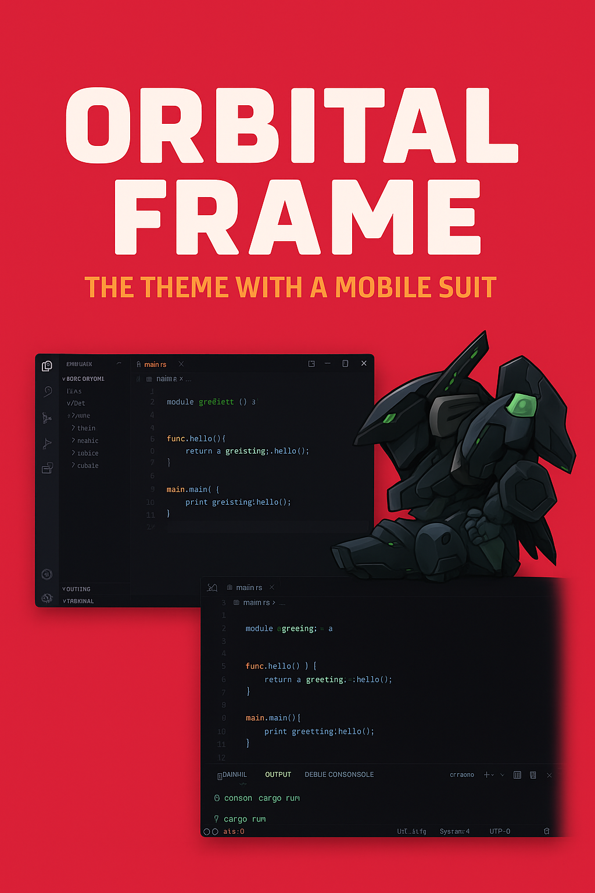

# Orbital Frames - JetBrains Theme Collection

A collection of dark themes for JetBrains IDEs inspired by orbital frames and mecha aesthetics. Features three carefully crafted color schemes: Anubis Dark, Jehuty Dark, and Nephtis Dark.

## 🎨 Themes

- **Anubis Dark** - Warm orange and red tones with high contrast
- **Jehuty Dark** - Cool cyan and blue tones with sleek aesthetics  
- **Nephtis Dark** - Golden and purple tones with mystical vibes

## 🚀 Installation

1. Download `orbital-frames-plugin.jar` from releases
2. Open your JetBrains IDE (IntelliJ IDEA, CLion, etc.)
3. Go to `File > Settings > Plugins`
4. Click gear icon > `Install Plugin from Disk...`
5. Select the downloaded JAR file
6. Restart IDE
7. Go to `Settings > Appearance & Behavior > Appearance > Theme` to select UI theme
8. Go to `Settings > Editor > Color Scheme` to select editor colors

## 📸 Preview

The theme brings the aesthetic of mecha and space exploration to your IDE with carefully crafted color schemes that enhance code readability while maintaining the futuristic orbital frame atmosphere.

## 🛠️ Development

This plugin includes both UI themes (`.theme.json`) and editor color schemes (`.icls`) for complete theming experience.

## 📄 License

MIT License - see LICENSE file for details

## 👤 Author

**Massinissa Amalou**
- Website: [m-amalou.me](https://m-amalou.me)
- GitHub: [@meastblue](https://github.com/meastblue)
- Email: amalou.massinissa@gmail.com